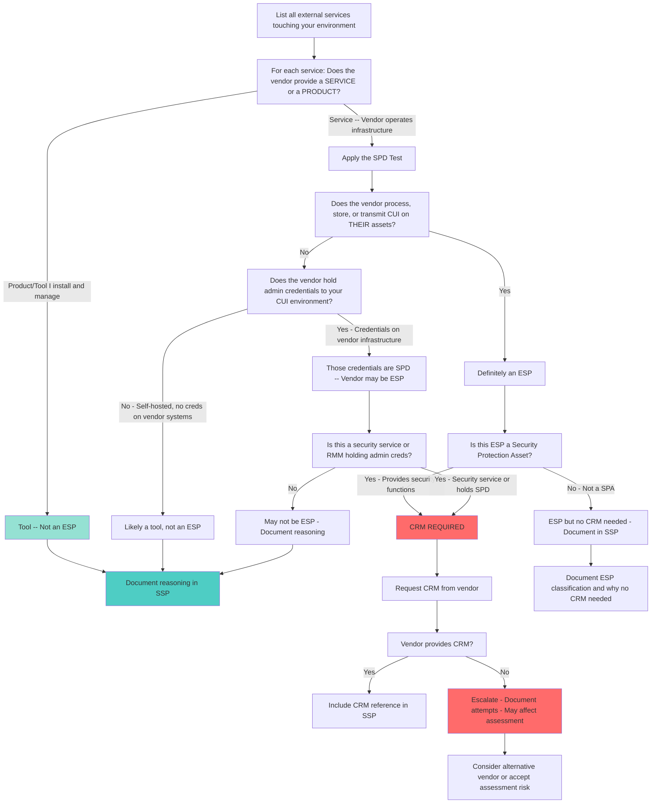

## Summary

An ESP (External Service Provider) is an external organization providing a service (not a product) that processes, stores, or transmits Security Protection Data (SPD) or CUI on their assets. The critical distinction is whether the vendor operates assets handling your SPD/CUI -- if you install and manage the tool yourself, it is not an ESP. Admin credentials to your CUI environment are SPD, so vendors holding those credentials on their infrastructure may be ESPs. ESP classification is one of the most debated topics in CMMC, and the decision determines whether you need a CRM from that vendor.

## Decision Tree

## Detailed Walkthrough

### 1. Service vs Product

The first distinction is fundamental: does the vendor provide a **service** or a **product**?

**Service:**
- Vendor operates the infrastructure
- Vendor's employees have access to systems handling your data
- Examples: Managed SOC, cloud-hosted RMM, SaaS security tools, MSP

**Product/Tool:**
- You install and manage the software/hardware yourself
- No data leaves your boundary
- Vendor does not have access to your environment
- Examples: On-prem firewall you manage, self-hosted monitoring tool, licensed software you run

**Key principle:** A product or tool you install and manage yourself is **not** an ESP -- the provider must operate assets handling your SPD/CUI.

*(Source: [[ESP (External Service Provider) Classification]], [[Scoping ESP and CRM Confusion]])*

### 2. The SPD Test

If the vendor provides a service, apply the SPD (Security Protection Data) test:

**Question 1:** Does this external provider process, store, or transmit **CUI** on their assets?
- If **yes** --> They are an ESP

**Question 2:** Does this external provider hold **admin credentials** to your CUI environment on their infrastructure?
- If **yes** --> Those credentials are SPD, and the provider may be an ESP

**Question 3:** Do you self-host the tool and no data leaves your boundary?
- If **yes** --> It is a tool, not an ESP

**Critical insight:** Admin passwords to your CUI environment are Security Protection Data. This is a critical and often-missed point. A vendor that holds your admin credentials on their cloud platform is handling SPD, which can elevate them from "just a tool" to an ESP.

*(Source: [[ESP (External Service Provider) Classification]])*

### 3. The NinjaOne/RMM Example

One of the most contentious Discord discussions demonstrates the ESP vs tool distinction:

**Is a Remote Monitoring and Management (RMM) tool like NinjaOne an ESP, or just a tool?**

**Scenario A -- Cloud-Hosted RMM:**
- NinjaOne's cloud platform holds admin credentials to your CUI environment
- Those credentials are SPD
- NinjaOne operates the infrastructure where SPD resides
- **Conclusion:** NinjaOne may be an ESP

**Scenario B -- Self-Hosted RMM:**
- You self-host the RMM tool on your own infrastructure
- No data (including credentials) leaves your boundary
- You operate and manage the infrastructure
- **Conclusion:** It is a tool, not an ESP

**The classification depends entirely on where the data (including credentials) resides and who operates the infrastructure.**

*(Source: [[ESP (External Service Provider) Classification]], [[Scoping ESP and CRM Confusion]])*

### 4. Is the ESP a Security Protection Asset?

If you have determined the vendor is an ESP, the next question is: does this ESP provide **security functions** for your CUI environment?

**Security Protection Asset (SPA):** Assets providing security functions for CUI but not processing CUI directly.

**Examples:**
- Firewalls
- SIEM/SOC services
- Identity and access management systems
- Vulnerability scanning services
- Managed detection and response (MDR)

**The CRM rule:**
- ESP that is a **SPA** --> CRM is required
- SPA that is **not** an ESP --> CRM is not required
- ESP that is **not** a SPA --> ESP classification applies but no CRM needed

*(Source: [[ESP (External Service Provider) Classification]], [[CRM (Customer Responsibility Matrix)]])*

### 5. Getting CRMs from Vendors

The current state of CRM availability is inconsistent -- "the wild wild west."

**Real-world vendor experiences:**

| Vendor Type | CRM Experience |
|---|---|
| Microsoft (GCC High) | Available via FedRAMP package -- must request it |
| Large cloud/SaaS vendors | Some provide proactively, others require escalation |
| Arctic Wolf | Assessors had trouble getting them to show up for interviews |
| Small/niche vendors | Often do not know what a CRM is |

**If vendor will not provide a CRM:**
- Escalate through vendor account management
- Document your attempts to obtain the CRM
- This may affect your assessment -- C3PAOs specifically look for CRM references in your SSP
- Consider alternative vendors if critical

**If vendor does not know what a CRM is:**
- Common with small/niche vendors
- You may need to educate them (provide examples, explain shared responsibility)
- Consider finding an alternative vendor
- Document your reasoning if you proceed without a CRM

*(Source: [[CRM (Customer Responsibility Matrix)]], [[Scoping ESP and CRM Confusion]])*

### 6. MSP as ESP

If your MSP holds admin credentials or touches CUI/SPD on their infrastructure, they are an ESP and need a CRM.

**MSP vetting is critical risk management:**

- MSPs without an SRM (Service Responsibility Matrix) cannot demonstrate what they are responsible for during an assessment
- **"Trunk slammers"** -- MSP industry term for providers who pad their portfolio without specializing in regulated defense work
- MSPs forcing clients to pay out remainder of contract terms before switching to CMMC-capable MSP
- Firing your MSP triggers significant change -- if you have already been certified, switching MSPs likely triggers re-certification ($40,000-$70,000)

**MSP partnership is a three-year commitment minimum** aligned to the certification lifecycle -- make the decision carefully and plan any transition before your renewal window.

**Reddit horror story:** An MSP employee was discovered asking who is responsible for talking to the assessor, revealing the MSP had no SRM and had lost their only CCP (Certified CMMC Professional).

*(Source: [[ESP (External Service Provider) Classification]], [[The CUI Hotline - Weekly CMMC Q&A Livestream!]])*

### 7. ESP Flowdown and Certification Status

ESPs are **not subcontractors** on defense contracts and therefore do **not** have DFARS 7012 flowdown requirements in the traditional sense:

- An ESP is an **extension of your support team**, not an entity executing the contract
- ESPs do **not need their own Level 2 certification**
- However, ESPs **do show up to your assessment** -- the C3PAO judges the ESP's controls as part of your certification boundary, not separately
- If your ESP/MSP **fails** their portion of the assessment, **you fail**

**DoD originally wanted ESP certification:** The proposed rule for 32 CFR 170 included a requirement for ESPs to achieve their own certification. DoD backed down to accommodate industry concerns, but Summit 7 anticipates this will eventually return: "Anything that they wanted they'll probably end up getting in the long run."

**Some MSPs are voluntarily getting certified** -- either because they are defense contractors themselves or to differentiate in the market. This is a good vetting question: do they walk the walk?

*(Source: [[ESP (External Service Provider) Classification]], [[The CUI Hotline - Weekly CMMC Q&A Livestream!]])*

### 8. Documenting ESP Classification in Your SSP

Regardless of whether a vendor is classified as an ESP or not, you must document your reasoning in your [[SSP Development|SSP]]:

**For vendors classified as ESPs:**
- Document the SPD test reasoning
- Include CRM references
- Explain the shared responsibility model
- List which controls the ESP implements vs which remain your responsibility

**For vendors classified as tools (not ESPs):**
- Document why they are not ESPs (self-hosted, no SPD on vendor infrastructure, etc.)
- Explain the deployment model
- Clarify that you manage and operate the tool

**Assessors will check your ESP documentation during Phase 1 review.** Inadequate ESP/CRM documentation is a common reason for getting stopped at Phase 1.

*(Source: [[SSP Development]], [[Assessment Process and Timeline]])*

### 9. Common ESP Examples

**Likely ESPs:**
- Cloud-hosted RMM tools (if admin creds on vendor infrastructure)
- Managed SOC/SIEM services
- Cloud backup services processing/storing CUI
- Managed firewall services
- MDR (Managed Detection and Response) providers
- MSPs with admin access to your environment
- Hosted enclave providers (require FedRAMP Moderate)

**Likely NOT ESPs:**
- Self-hosted RMM tools
- On-prem firewalls you manage
- Software licenses you run on your infrastructure
- SaaS tools that do not process CUI or SPD
- Cloud services where you control all access and vendor has no visibility (depends on service model)

**Gray area requiring careful analysis:**
- Productivity SaaS tools
- Collaboration platforms
- Developer tools and CI/CD pipelines
- Analytics platforms

*(Source: [[ESP (External Service Provider) Classification]])*

## Decision Criteria Summary

### Classify as ESP If:

- Vendor operates assets that process, store, or transmit your CUI
- Vendor's cloud platform holds your admin credentials to CUI environment
- Vendor employees have access to systems handling your SPD

### Classify as Tool (Not ESP) If:

- You self-host entirely on your infrastructure
- No data (including credentials) leaves your boundary
- Vendor has no access to your environment

### Require CRM If:

- ESP is classified as a Security Protection Asset (provides security functions)
- Example: Managed SOC, MDR, firewall service, identity management

### Do Not Require CRM If:

- SPA is not an ESP (you manage it yourself)
- ESP is not a SPA (provides non-security service but handles CUI/SPD)

### If Vendor Will Not Provide CRM:

- Escalate through vendor management
- Document attempts
- Consider alternative vendors
- Understand this may affect assessment

## Common Misconceptions

| Misconception | Reality | Source |
|---|---|---|
| All cloud tools are ESPs | Only services that handle SPD or CUI on the vendor's assets qualify | [[ESP (External Service Provider) Classification]] |
| A product you manage is an ESP | A product/tool you install and manage yourself is not an ESP | [[ESP (External Service Provider) Classification]] |
| RMM tools are always ESPs | Depends on deployment: cloud-hosted with your admin creds = likely ESP; self-hosted = tool | [[ESP (External Service Provider) Classification]] |
| Only CUI matters for ESP classification | Admin credentials (SPD) on vendor infrastructure also trigger ESP classification | [[ESP (External Service Provider) Classification]] |
| Your MSP is just a vendor, not an ESP | If your MSP holds admin creds or touches CUI/SPD on their infrastructure, they are an ESP and need a CRM | [[ESP (External Service Provider) Classification]] |
| ESPs need their own Level 2 certification | ESPs are not subcontractors and do not need their own certification -- but they show up to your assessment and are judged as part of your boundary | [[The CUI Hotline - Weekly CMMC Q&A Livestream!]] |
| DFARS 7012 flows down to ESPs | ESPs are extensions of your support team, not contract executors -- no DFARS 7012 flowdown, but independent ESP requirements apply | [[The CUI Hotline - Weekly CMMC Q&A Livestream!]] |

## Vendor-Specific Examples

### Microsoft GCC High

- **Classification:** ESP (cloud service provider)
- **SPA Status:** Yes (provides security functions)
- **CRM Required:** Yes
- **How to get it:** Request FedRAMP package from Microsoft
- **Notes:** Non-negotiable for assessment if you use GCC High

### Cloud-Hosted RMM (e.g., NinjaOne)

- **Classification:** Depends on deployment
- **If cloud-hosted with admin creds on vendor infrastructure:** ESP
- **If self-hosted:** Tool, not ESP
- **SPA Status:** May be SPA if provides security monitoring functions
- **CRM Required:** If ESP and SPA

### Managed SOC/MDR Provider

- **Classification:** ESP
- **SPA Status:** Yes
- **CRM Required:** Yes
- **Notes:** Core security function -- CRM essential to document shared responsibility

### Arctic Wolf

- **Classification:** ESP (managed security service)
- **SPA Status:** Yes
- **CRM Required:** Yes
- **Notes:** Real-world challenge -- assessors had trouble getting them to show up for interviews

### Productivity SaaS (Non-CUI)

- **Classification:** Likely not ESP if does not process CUI or SPD
- **SPA Status:** No
- **CRM Required:** No
- **Notes:** Document why not an ESP in SSP

## Open Questions / Debates

The ESP vs tool line remains one of the most contentious areas in CMMC. Even assessors disagree on specific cases. The NinjaOne/RMM question exemplifies this: reasonable practitioners can arrive at different conclusions depending on how they interpret "processing SPD on their assets."

**MSP Collective:** Summit 7 leads this initiative attempting to standardize the ESP assessment approach, but the effort is still evolving. Until there is clearer guidance or a published validation method, companies must document their reasoning and be prepared to defend their classification decisions during assessment.

**No published CRM validation method yet:** Companies must take vendor-provided CRMs at face value or do their own due diligence. Assessment teams have no standardized way to verify CRM accuracy. Your best defense is documenting your reasoning for how you validated the CRM you received.

*(Source: [[ESP (External Service Provider) Classification]], [[Scoping ESP and CRM Confusion]], [[CRM (Customer Responsibility Matrix)]])*

## Related Topics

- [[Scoping and Assessment Boundaries]] -- ESP classification is the hardest part of scoping
- [[CRM (Customer Responsibility Matrix)]] -- required from ESPs that are SPAs
- [[SSP Development]] -- ESP documentation and classification reasoning must be in the SSP
- [[FedRAMP Requirements]] -- FedRAMP applies when cloud ESPs handle CUI
- [[Assessment Process and Timeline]] -- CRM completeness checked during assessment Phase 1
- [[Enclaves and Architecture Strategies]] -- hosted enclave providers as ESPs requiring FedRAMP

## Sources

- [[ESP (External Service Provider) Classification]] -- ESP definition, ESP vs tool debate, the SPD test, NinjaOne/RMM example, admin credentials as SPD, MSP Collective initiative, ESP not subcontractors (no flowdown, no own cert required), DoD originally wanted ESP certification (backed down), MSPs voluntarily certifying, MSP vetting risks (trunk slammers, no SRM, Reddit horror story), firing MSP triggers significant change ($40-70K re-certification), three-year commitment minimum
- [[Scoping ESP and CRM Confusion]] -- ESP classification as hardest scoping challenge, vendor CRM experiences, MSP Collective, CRM validation gap
- [[CRM (Customer Responsibility Matrix)]] -- CRM requirements, GCC High FedRAMP CRM, vendor CRM experiences (Microsoft, Arctic Wolf, large SaaS, small/niche), "wild wild west" state, no published validation method
- [[The CUI Hotline - Weekly CMMC Q&A Livestream!]] -- ESPs show up to assessment, ESP failure = your failure, DoD backed down from ESP certification requirement
- [[Assessment Process and Timeline]] -- ESP/CRM documentation checked during Phase 1, inadequate ESP/CRM docs common failure reason
- [[SSP Development]] -- ESP documentation requirements, CRM references in SSP
