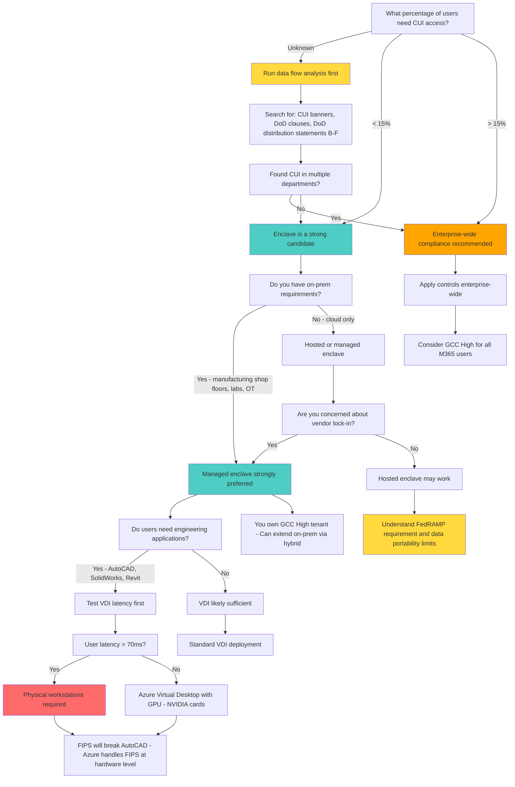

## Summary

The decision between enclave and enterprise architecture hinges on how many users need CUI access and whether you have on-premises requirements. If less than 15% of users need CUI access, an enclave strategy reduces scope and cost. If more than 15%, the overhead of maintaining two separate environments and the risk of CUI spillage make enterprise-wide compliance more practical. Hosted enclaves offer simplicity but limited extensibility; managed enclaves provide control and data portability. CRMAs (Contractor Risk Managed Assets) are described as "a damn dirty trap" that can backfire during assessment.

## Decision Tree

## Detailed Walkthrough

### 1. Data Flow Analysis -- The Critical First Step

Before deciding on architecture, you must know where all your CUI lives. Daniel Acreage (Summit 7) recommends searching your M365 commercial tenant and on-prem file systems for:

- **CUI banner markings**
- **DoD clauses**
- **DoD distribution statements** (Parts B through F)

**Construction company example:** A large construction company's CIO planned a 20-person enclave based on gut feeling. After running distribution statement searches, they found **570 files from DoD distribution statements alone** -- and that was only what Microsoft could OCR through PDFs, email, and standard Office attachments. It did not include AutoCAD, SolidWorks, or Revit files. The actual CUI footprint was far larger than 20 people.

**Why this matters:** This search pays dividends because it prevents the painful "second ask" to executives when you discover six months later that the enclave needs to be much larger than originally planned. Do one big ask with as much data as possible.

**Important:** IT cannot answer these questions alone. CMMC is not solely an IT problem. Data flow analysis requires input from BD, contracts, engineering, and executive leadership. IT supports the infrastructure where CUI may live, but they do not always know whether the data on that infrastructure is CUI.

*(Source: [[Enclaves and Architecture Strategies]], Summit 7, June 2025)*

### 2. The 15% Rule

If more than 15% of users need access to CUI, the overhead of maintaining two separate environments (enclave + corporate) and the risk of CUI spillage increases significantly. Users take the path of least resistance and will bypass enclave controls.

**Enclave overhead includes:**
- Separate identity systems or account provisioning
- Two sets of applications and licenses
- Data transfer controls between environments
- User training on which environment to use for what work
- Monitoring and preventing CUI spillage to corporate environment

**When enclave makes sense (< 15% users):**
- Reduces assessment scope
- Lowers implementation and ongoing costs
- Clear boundary between CUI and non-CUI work

**When enterprise-wide makes sense (> 15% users):**
- Avoids dual environment overhead
- Reduces risk of users bypassing controls
- Simplifies user experience
- May be more cost-effective at scale

*(Source: [[Enclaves and Architecture Strategies]], Summit 7, June 2025)*

### 3. Hosted vs Managed Enclave

There are two fundamental enclave delivery models:

#### Hosted Enclave

You buy a per-seat subscription to someone else's environment.

**Pros:**
- Simplest setup
- Provider owns hardware and infrastructure
- Turnkey solution

**Cons:**
- Does not scale well
- **Hard to get your data out** if you need to change providers (one organization took three months to migrate out)
- **Difficult to extend on-prem** for hybrid use cases (manufacturing shop floors, research labs)
- Requires the hosted provider to be **FedRAMP Moderate** (or equivalent) since they are acting as a CSP
- You still cannot avoid the customer responsibility matrix
- Vendor lock-in risk

#### Managed Enclave

You own the Microsoft GovCloud subscriptions and a partner manages them.

**Pros:**
- You own the Microsoft GCC High tenant and Azure Gov subscriptions
- You **inherit Microsoft's SSP** for physical controls and platform security
- You inherit the managed service provider's customer responsibility matrix (e.g., Summit 7's CRM)
- **Data portability**: If you part ways with the managed provider, the environment keeps running -- your data stays in your tenant
- Can extend on-prem through hybrid configurations
- Better for long-term control

**Cons:**
- Requires more engagement and ownership
- You are responsible for subscription costs

**Recommendation:** Most organizations prefer the managed model for control and portability.

*(Source: [[Enclaves and Architecture Strategies]], Summit 7, June 2025)*

### 4. On-Premises Integration Requirements

If you have on-prem requirements, a managed enclave is strongly preferred. Hosted enclaves are difficult to extend on-prem.

**Common on-prem scenarios:**

**Manufacturing:**
- Shop floor printing (drawings for assembly)
- CNC machines and specialized equipment (may run Windows XP, Windows 2000, or MS-DOS)
- Test equipment
- USB staging laptop approach (physical laptop joined to GovCloud pulls data over TLS, copies to approved encrypted USB, carried to shop floor)
- Physical site consolidation (large manufacturers with defense work across 50+ sites worldwide may consolidate CUI-processing to one or two US-based sites)

**AEC (Architecture, Engineering, Construction):**
- Blueprint plotting for job sites
- Secure print room (designated physical room as CUI print room to avoid bringing entire facility into scope)
- Pooled licensing via site-to-site VPN (connect back to on-prem license servers -- the license server itself is not a CUI asset)
- Enclave trailer concept (mobile enclave driven to job sites)

**Regulated Research:**
- High-performance compute on-prem environments
- Physical research labs connected back to GovCloud via site-to-site VPN
- Approximately 200+ labs in large research institutes, each managed differently

*(Source: [[Enclaves and Architecture Strategies]], Summit 7, June 2025)*

### 5. VDI vs Physical Workstations

Virtual desktop infrastructure (VDI) works well for many use cases but has critical limitations.

#### VDI Latency Threshold

Virtual desktop performance degrades badly above **70 milliseconds** of latency. Test the worst-case user location before committing to a VDI-based enclave.

**Who works well on VDI:**
- Sales and BD teams
- Administrative users
- Document-centric workflows

**Who may need physical workstations:**
- Engineering applications (AutoCAD, SolidWorks, Revit)
- Manufacturing engineering applications requiring GPU performance
- Users with latency above 70ms

#### Azure Virtual Desktop with GPUs

For engineering applications in enclaves, the standard platform is **Azure Virtual Desktop with NVIDIA cards** (GPU-backed virtual desktops). H100 cards are currently available in Azure Gov, H200s are forthcoming.

**FIPS breaks engineering software:** Enabling FIPS on physical devices breaks AutoCAD, QuickBooks, and other common applications. Azure handles FIPS at the hardware/drive level, avoiding this issue for cloud-hosted applications.

*(Source: [[Enclaves and Architecture Strategies]], Summit 7, June 2025; [[FIPS 140-2 and 140-3 Compliance]]*

### 6. The CRMA Trap

**CRMA (Contractor Risk Managed Asset):** Assets on the same network as CUI assets but not supposed to process CUI. These require only policies and procedures, not all 110 controls.

**Why it is "a damn dirty trap":**

An assessor can challenge the CRMA classification and require assessment against all 110 controls on that asset, creating a nasty surprise if you were not prepared. If you classify an asset as CRMA and the assessor disagrees, you may fail the assessment.

**Recommendation:** Do not rely on CRMA to avoid controls. If an asset touches the CUI network, be prepared to defend why it does not process, store, or transmit CUI -- or just apply all 110 controls to avoid the risk.

*(Source: [[Enclaves and Architecture Strategies]], Summit 7, June 2025)*

### 7. Asset Types Within an Enclave

| Asset Type | Description | Controls Required | Notes |
|---|---|---|---|
| **CUI Asset** | Systems that process, store, or transmit CUI | All 110 CMMC L2 controls | Always in scope |
| **Security Protection Asset (SPA)** | Assets providing security functions for CUI but not processing CUI directly | Relevant security controls | Firewalls, SIEM, identity systems |
| **Contractor Risk Managed Asset (CRMA)** | Assets on the same network as CUI assets but not supposed to process CUI | Policies and procedures | "A damn dirty trap" -- assessor can upgrade to full 110 control assessment |
| **Specialized Asset** | OT, IoT, test equipment, government property, restricted info systems | Risk-based approach | Does NOT require all 110 controls; critical for manufacturing and research |

*(Source: [[Enclaves and Architecture Strategies]], Summit 7, June 2025)*

### 8. Printing CUI

Print jobs are sent in plain text by default. This creates scoping challenges.

**Options:**

1. **Avoid printing** -- Use tablets and digital workflows instead (CUI-compliant iPads joined to GovCloud for reviewing drawings on job sites)
2. **Encrypted USB + staging laptop** -- Physical laptop joined to GovCloud pulls data over TLS, copies to approved encrypted USB, carried to printer not traversing the network
3. **FIPS-enabled printers** -- Very expensive and hard to find
4. **Printer Logic** -- FIPS 140 encryption from enclave through to the remote printer, with badge/code release at the device, over a site-to-site VPN. Summit 7 argues this should be treated the same as TLS to GCC High and has held up in their own CMMC certification.

**Do NOT:** Send plain-text print jobs across a network that is supposedly out of scope -- it brings the network into scope.

*(Source: [[Enclaves and Architecture Strategies]], Summit 7, June 2025)*

### 9. Mobile Access

**Hyporei Android app:** Enables mobile CUI access through an Android instance running Microsoft GovCloud apps, eliminating the need for two physical devices (one for corporate, one for CUI).

**CUI-compliant tablets:** iPads joined to the GovCloud for reviewing drawings and taking pictures on job sites, with uploads going directly to OneDrive/SharePoint/Teams. Alternate work site policy covers remote workers connecting from home to GCC High over TLS -- their home network is not in scope because the connection is FIPS-validated encrypted end-to-end.

*(Source: [[Enclaves and Architecture Strategies]], Summit 7, June 2025)*

### 10. Industry-Specific Considerations

#### Manufacturing Enclaves

- Engineering applications (AutoCAD, SolidWorks) require GPU-backed virtual desktops
- Print-to-shop-floor workflow challenges
- Specialized assets (CNC machines running legacy OS -- Windows XP, 2000, MS-DOS) can use risk-based approach
- Physical vs VDI -- sales/BD may work on VDI, but engineering may require physical workstations

#### AEC Enclaves

- Same engineering applications as manufacturing
- Blueprint plotting and job site requirements
- Blue Beam workaround (local install option can be self-hosted inside enclave -- "you have to go through three back doors and knock twice" but it exists)
- Tablets for job sites instead of printing
- Secure print room strategy

#### Regulated Research Enclaves

- MatLab, Python, domain-specific research tools
- Non-US person segmentation (use Purview site containers, custom attributes, dynamic groups)
- Chargeback per grant/contract/subscription (build this on the front end, not retroactively)
- Centralized oversight critical -- do NOT let departments spin up their own enclaves
- Top 10 university discovered two high-performance compute environments in a closet that the CIO did not know existed

*(Source: [[Enclaves and Architecture Strategies]], Summit 7, June 2025)*

## Decision Criteria Summary

### When to Choose Enclave

- **Less than 15% of users need CUI access**
- Clear boundary between CUI and non-CUI work
- Want to reduce assessment scope and cost
- Can run data flow analysis and confirm limited CUI footprint

### When to Choose Enterprise-Wide

- **More than 15% of users need CUI access**
- CUI is spread across many departments and workflows
- Dual environment overhead outweighs enclave benefits
- Want to simplify user experience and reduce spillage risk

### Hosted vs Managed (if choosing enclave)

**Managed Enclave if:**
- Need on-prem integration (shop floors, labs, OT)
- Concerned about vendor lock-in
- Need to scale over time
- Want data portability

**Hosted Enclave if:**
- Small team, want simplest possible setup
- Cloud-only requirements
- Understand FedRAMP requirement and accept data portability limitations

### Physical Workstations vs VDI

**VDI if:**
- User latency under 70ms
- Sales/BD/administrative users
- Document-centric workflows

**Physical Workstations if:**
- User latency above 70ms
- Engineering applications with GPU requirements
- Manufacturing OT environments

## Common Misconceptions

| Misconception | Reality | Source |
|---|---|---|
| "20 users = our CUI footprint" | Without data flow analysis, gut estimates are almost always wrong; one company thought 20, found 570 files | [[Enclaves and Architecture Strategies]] |
| "I can build an enclave for all my suppliers" | Suppliers using your enclave for their CMMC boundary cannot do competitive work for other primes in your environment | [[Enclaves and Architecture Strategies]] |
| "CRMA is a good way to avoid controls" | CRMAs are "a damn dirty trap" -- assessor can challenge and require all 110 controls | [[Enclaves and Architecture Strategies]] |
| "VDI works for everyone" | Latency above 70ms makes VDI unusable; engineering applications may require physical workstations | [[Enclaves and Architecture Strategies]] |
| "We just need to enable FIPS on everything" | Enabling FIPS breaks AutoCAD, QuickBooks, and others -- Azure handles FIPS at hardware level | [[Enclaves and Architecture Strategies]] |
| "An enclave is our forever solution" | Enclave may be a stop-gap while you figure out your actual CUI scope -- often the beginning, not the end | [[Enclaves and Architecture Strategies]] |
| "IT can handle enclave scoping alone" | Data flow analysis requires BD, contracts, engineering, and executive input | [[Enclaves and Architecture Strategies]] |

## Open Questions / Debates

- **Supplier enclave certification boundary:** If you build an enclave and allow suppliers to use it for their CMMC scope, how do you handle the certification boundary when those suppliers do competitive work with other primes? No clean answer exists yet.
- **Rev 3 impact on specialized assets:** Rev 2 allows a risk-based approach for specialized assets (OT, CNC machines). Rev 3 may be "a little bit more heavy-hitting." Proactively seek DoD CIO exemptions for EOL systems now.
- **EOL software and records retention:** Revit releases yearly with only 3 years of support, but DoD requires records retention of data created in older versions. Recommended approach: seek DoD CIO exemptions proactively.
- **Encrypted print job scoping:** Whether FIPS 140 encrypted print (e.g., Printer Logic) keeps intermediary network out of scope is still debated by assessors. Summit 7 argues it should be treated same as TLS to GCC High.

*(Source: [[Enclaves and Architecture Strategies]], Summit 7, June 2025)*

## Related Topics

- [[Scoping and Assessment Boundaries]] -- asset classifications and assessment boundary decisions
- [[FIPS 140-2 and 140-3 Compliance]] -- FIPS application breakage, Azure hardware FIPS, encrypted print
- [[GCC High vs Commercial M365]] -- GCC High as cloud foundation for enclaves
- [[Market Dynamics and Service Needs]] -- enclave demand across verticals
- [[ESP (External Service Provider) Classification]] -- hosted enclave providers as ESPs requiring FedRAMP
- [[CRM (Customer Responsibility Matrix)]] -- managed enclave CRM inheritance from Microsoft SSP and service providers
- [[SSP Development]] -- documenting enclave boundary and asset classifications
- [[Assessment Process and Timeline]] -- how enclave boundaries affect what gets assessed

## Sources

- [[Enclaves and Architecture Strategies]] -- Complete enclave decision framework, 15% rule, data flow analysis methodology, construction company 570-file example, hosted vs managed models, asset types (CUI/SPA/CRMA/Specialized), CRMA trap, VDI latency threshold (70ms), manufacturing/AEC/regulated research considerations, printing challenges, Printer Logic encrypted print, Hyporei mobile, Azure Virtual Desktop with GPUs, FIPS breaks AutoCAD, Blue Beam workaround, supplier enclave certification boundary gotcha, specialized assets risk-based approach, EOL software exemptions, pooled licensing via site-to-site VPN, enclave trailer concept, non-US person segmentation, chargeback model, university horror story (closet compute environments), physical site consolidation
