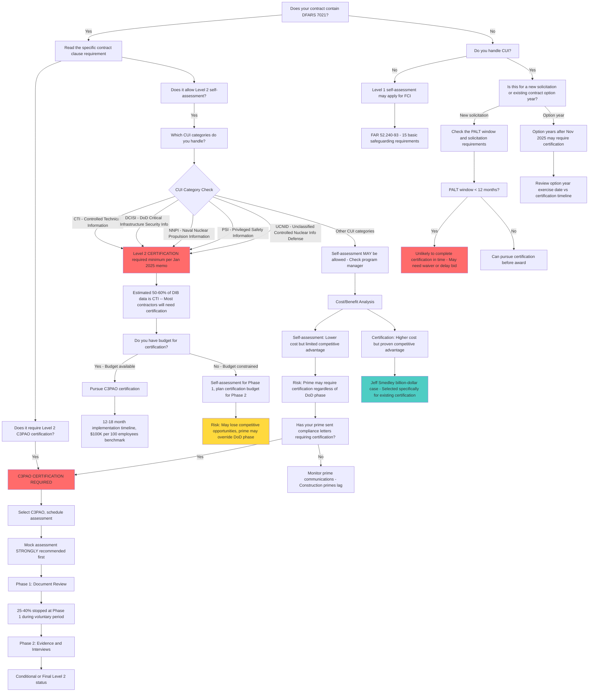

## Summary

The decision between self-assessment and C3PAO certification depends on contract requirements (DFARS 7021), CUI categories handled (CTI/DCISI/NNPI/PSI/UCNID require certification as minimum in Phase 1), cost/benefit analysis, competitive advantage, and FCA risk. While 32 CFR 170.3(E) suggests Phase 1 will be "a majority" self-assessments, nothing prohibits DoD from requiring Level 2 C3PAO certification during Phase 1, and solicitations already show this happening. Early adopters who achieved voluntary certification are winning billion-dollar contracts based on compliance status. Submitting a false SPRS score creates immediate False Claims Act exposure.

## Decision Tree

## Detailed Walkthrough

### 1. Contract Requirements -- DFARS 7021

The first question is whether DFARS 7021 is already in your contract. If yes, read the specific language carefully.

**DFARS 252.204-7021** is the CMMC certification clause. Phase 1 rollout began November 10, 2025.

**Key facts:**
- 7021 sits **on top of** DFARS 7012/7019 -- it does not replace them
- 7012 already requires NIST 800-171 implementation for CUI
- 7021 adds the third-party verification requirement
- If 7021 specifies Level 2 C3PAO certification, self-assessment is not an option

*(Source: [[DFARS Clauses and Legal Requirements]], [[When is CMMC Required]])*

### 2. CUI Categories Triggering Certification (January 2025 DoD Memo)

The January 2025 DoD memo on implementing CMMC (Attachment 1) identifies **five specific CUI categories** that establish Level 2 **certification** (not self-assessment) as the **minimum** requirement:

1. **CTI** -- Controlled Technical Information
2. **DCISI** -- DoD Critical Infrastructure Security Information
3. **NNPI** -- Naval Nuclear Propulsion Information
4. **PSI** -- Privileged Safety Information
5. **UCNID** -- Unclassified Controlled Nuclear Information related to Defense

**Critical insight:** An estimated **50-60% of all DIB data** likely falls into the CTI category alone. This means a majority of defense contractors handling CUI are potentially subject to Level 2 certification requirement rather than self-assessment, depending on program manager discretion during Phase 1.

**What this means:** Even if your contract does not yet specify Level 2 C3PAO, if you handle any of these five CUI categories, certification may be the minimum requirement.

*(Source: [[Defense Contractors are Betting Their Companies on THIS Assumption About CMMC Phase 1]], Summit 7, September 2025; [[CMMC Levels and Framework Structure]])*

### 3. Phase 1 Does NOT Mean Only Self-Assessment

A detailed analysis of 32 CFR 170.3 paragraph E reveals that the Phase 1 rollout does **not** prohibit Level 2 certification assessments.

**The regulatory text (32 CFR 170.3(E)):**
- States DoD "intends to include" Level 1 and Level 2 **self-assessment** requirements during Phase 1
- But adds: "DoD may at its discretion include the requirement for CMMC status of Level 2 C3PAO [certification] in place of Level 2 self-assessments for **applicable** DoD solicitations and contracts"
- Neither "discretion" nor "applicable" are defined in the rule text

**Key observations:**
- The preamble states "a **majority** of CMMC requirements will be for self-assessment" during Phase 1 -- "majority" does not mean "all"
- Program managers have discretion to determine the applicable CMMC level
- No public policy document contains a moratorium on Level 2 certification assessments during Phase 1
- Some requiring activities have stated they **will** require Level 2 certification across the board during Phase 1 for sensitive programs

**Real-world evidence:** 7 SAM.gov notices appeared within weeks of Phase 1 starting, including:
- Navy NAVSEA requiring Level 2 for semiconductor manufacturing
- Army Corps of Engineers requiring Level 2 C3PAO for GBSD Sentinel facilities (FY27 award)
- US SOCOM requiring Level 1 with full supply chain requirement (disqualification if any sub does not meet CMMC)

*(Source: [[Defense Contractors are Betting Their Companies on THIS Assumption About CMMC Phase 1]], Summit 7, September 2025; [[CMMC Requirements Are Starting To Show Up]], Summit 7, October 2025)*

### 4. The Option Year Trap

Contract option years represent a frequently overlooked trigger.

**Key risk:** Existing contracts with option years exercised after 48 CFR goes into effect (November 10, 2025) may require CMMC certification.

**Why this matters:**
- Unlike new solicitations where you can choose whether to bid, option years hit existing work where you already have staff, infrastructure, and revenue at stake
- You cannot control the timing the way you can with new solicitations
- This is described as "the thing that a lot of people are snoozing on"

**Action:** Review your existing contracts for option year exercise dates and determine whether CMMC requirements may be added.

*(Source: [[Defense Contractors are Betting Their Companies on THIS Assumption About CMMC Phase 1]], Summit 7, September 2025)*

### 5. Prime Contractor Independence

Nothing in 32 CFR or DoD memos restricts what primes can require of subcontractors. Primes can independently require certification regardless of the DoD phased rollout.

**Prime acceleration:** Primes are telling subcontractors to get ready now, regardless of the DoD phased rollout:
- Primes cannot wait for the rollout timeline -- they need supply chain readiness before contracts require it
- Since most DIB companies work for primes (not directly for DoD), what the prime requires matters more than what DoD says the phase should be
- "We don't know if or when you need the CUI, and by the time we do know, we can't wait for you to then turn around and take 18 months to get ready"

**Supplier letters (late 2025):** All major primes have been sending supplier notices:
- Lockheed Martin, RTX (Raytheon), BAE Systems, HII (Huntington Ingalls), Northrop Grumman
- Northrop's letter explicitly states: "Contracting officers may not award contracts to non-compliant contractors" and "prime contractors may not award purchase orders to non-compliant subcontractors"
- Summit 7 reports these supplier announcements drove **more inquiries than any of the rulemaking milestones**

**Subcontractor flowdown (32 CFR 170.23A3):** If a subcontractor will process, store, or transmit CUI in performance of the subcontract, and the associated prime contract has a requirement for CMMC Level 2 C3PAO, then CMMC Level 2 C3PAO is the **minimum requirement** for the subcontractor.

*(Source: [[Primes Can't Waive CMMC]], Summit 7, December 2025; [[CMMC Phase 1 - What Comes Next]], Summit 7, November 2025)*

### 6. PALT Window Analysis

PALT (Procurement Administrative Lead Time) is the window from solicitation to award. This determines whether you have realistic time to achieve certification before award.

**NAVAIR data (1,070 opportunities, December 2025 forecast):**

| Contract Value | Average PALT (Months) | Implication |
|---|---|---|
| Under $2M | ~8 | Impossible for most to certify in time |
| $2M -- $7.5M | ~9 | Very tight timeline |
| $100M -- $250M | ~15 | First comfortable window |

**The mismatch:**
- Implementation timeline from ground zero: **12-18 months** (Jeff Smedley benchmark)
- Average PALT: **8-10 months**
- Result: 85% of organizations cannot achieve certification within typical PALT window

**What consumes the time:**
- Internal procurement to engage consultant/MSP: ~3 months
- Technical buildout: variable
- **Organizational and cultural adoption:** the "long pull in the tent"
- SSP development and documentation
- Mock assessment and remediation
- Actual C3PAO assessment

**35% of NAVAIR opportunities have 6 months or less award window** -- making it essentially impossible for organizations starting from scratch.

*(Source: [[No CMMC, No Contract - Why You're Already Too Late for NAVAIR]], Summit 7, February 2026; [[Getting CMMC Executive Buy-In with Jeff Smedley]], Summit 7, July 2025)*

### 7. Cost Analysis

**Self-Assessment:**
- Internal resource time for assessment
- SSP development (can use templates but must tailor)
- SPRS score submission
- Annual affirmation in years 2 and 3
- No C3PAO fees
- **Risk:** Limited competitive advantage, may not satisfy prime requirements

**C3PAO Certification:**
- Implementation: **$100,000 per 100 employees** benchmark (ground zero to certified)
- Timeline: **12-18 months**
- C3PAO assessment fees: variable by organization size and scope
- Mock assessment recommended (additional cost but prevents false starts)
- **Benefit:** Proven competitive advantage, satisfies all requirements

**Cost breakdown contributors:**
- GCC High migration (if needed)
- Hardware/infrastructure upgrades
- Consultant/MSP engagement
- Policy and procedure development
- SSP development to assessment objective level (SP 800-171A -- 320 criteria)
- Training and cultural adoption
- CRM acquisition from ESPs
- Assessment fees

*(Source: [[Getting CMMC Executive Buy-In with Jeff Smedley]], Summit 7, July 2025; [[Assessment Process and Timeline]])*

### 8. Competitive Advantage -- The Jeff Smedley Case

Jeff Smedley's company was selected by Lockheed for a billion-dollar opportunity specifically because "we know you already have CMMC taken care of."

**Key insights:**
- Early compliance became a competitive differentiator worth billions
- Primes are selecting subcontractors based on certification status
- Companies without certification may be excluded from consideration even before solicitation
- **As of October 2025:** Over 450 Level 2 certifications existed -- all obtained voluntarily before any contract required it

**The JSVA program:** Smedley used the Joint Surveillance Voluntary Assessment program, which combined a DIBCAC/DCMA-driven assessment alongside a C3PAO assessment, providing both a high-confidence on-site SPRS score and a C3PAO CMMC Level 2 certification simultaneously. Described as "bang for the buck."

*(Source: [[Getting CMMC Executive Buy-In with Jeff Smedley]], Summit 7, July 2025; [[CMMC Phase 1 - What Comes Next]], Summit 7, November 2025)*

### 9. False Claims Act Risk

**DFARS 7012 compliance is already required** for contracts with CUI. The False Claims Act applies regardless of CMMC status.

**Key precedents:**
- **Aerojet Rocketdyne:** Established that cybersecurity compliance under DFARS 7012 is **material to the contract**
- Submitting invoices without DFARS 7012 compliance constitutes a false claim
- 2025 FCA settlement covered 2018-2023 -- a period when CMMC was paused but DFARS 7012/7019/7020 remained in effect

**SPRS score as false claim:**
- Submitting a SPRS score is a "knowing" representation to the government
- If that score is false, it is a false claim
- DFARS 7019/7020 create documented, trackable representations of compliance

**The self-assessment trap:** If you submit a self-assessment score claiming 110/110 compliance while knowingly non-compliant (e.g., using M365 Commercial instead of GCC High, no FIPS validation, no MFA on privileged accounts), you have immediate FCA exposure.

**What about the FedRAMP gap?** Many contractors meet all 110 NIST 800-171 controls but do not meet FedRAMP requirements (e.g., hosting CUI in non-FedRAMP Moderate cloud). SPRS has no checkbox for FedRAMP status. Options:
- Submit 109 (one point lower as heads-up to government)
- Add proposal language disclosing the gap
- Document via POA&M

**Critical principle:** Do not bury your head in the sand. Transparency with the government about your compliance posture is essential.

*(Source: [[FCA Whistleblower Strikes Again]], Summit 7, December 2025; [[DOJ vs Small Defense Contractors]], Summit 7, April 2025; [[When CMMC Meets Contracts]], Summit 7, February 2026)*

### 10. Assessment Process Realities

**Mock assessment strongly recommended:**
- Follows same format as real assessment
- Identifies gaps before they become failures
- Does **not** get reported to SPRS
- Risk-free dry run

**False start rate:** During voluntary market rollout (2025), **25-40% of companies** that signed up for assessments were told to come back later -- they were not ready.

**Common reasons for Phase 1 stops:**
- SSP is template with generic language, not tailored
- Abnormally short SSPs (12 pages will not pass)
- Controls not addressed to assessment objective level (171A, not just 171)
- Non-FedRAMP Moderate cloud providers (M365 Commercial instead of GCC High)
- Missing or inadequate CRM references
- "Our MSP will handle everything" -- red flag indicating OSC does not understand shared responsibility

**Top 2 failed controls (per Fernando Machado, C3PAO):**
1. **FIPS validated cryptography** -- firewalls with latest firmware but not put into FIPS mode
2. **Multi-factor authentication** -- scoping misunderstanding (MFA applied in one area but not another, especially firewalls)

**The biggest hurdle is non-technical:** Documentation, not technology. "If it's all in your head, you're probably not going to pass."

*(Source: [[What to Know From a C3PAO]], Summit 7, December 2024; [[CMMC Phase 1 - What Comes Next]], Summit 7, November 2025)*

### 11. Conditional vs Final Certification

**Conditional certification (with open POA&M items):** A fully valid CMMC Level 2 status for contract award purposes, as long as items comply with CMMC policy for allowable open items.

**Key point:** You do not need a perfect 110/110 to win contracts. Conditional status is acceptable.

**POA&M requirements:**
- Must show reasonable remediation timeline
- Critical controls cannot be open
- Must comply with CMMC policy for allowable POA&M items

*(Source: [[CMMC Phase 1 - What Comes Next]], Summit 7, November 2025)*

## Decision Criteria Summary

### Pursue C3PAO Certification Now If:

- DFARS 7021 in contract requires Level 2 C3PAO
- You handle CTI, DCISI, NNPI, PSI, or UCNID (certification minimum per Jan 2025 memo)
- Your prime has sent compliance letters requiring certification
- PALT window is 12+ months and you have budget
- You want competitive advantage (early adopters winning work)
- You have FCA exposure from non-compliance with DFARS 7012

### Self-Assessment May Be Acceptable If:

- Contract explicitly allows Level 2 self-assessment
- You handle CUI categories outside the five requiring certification
- Program manager has not exercised discretion to require certification
- PALT window is too short for certification (< 12 months)
- Budget constraints prevent certification in Phase 1
- **BUT:** Monitor prime communications -- they may override DoD phase

### Cannot Avoid Certification If:

- DFARS 7021 specifies Level 2 C3PAO
- You handle one of the five CUI categories requiring certification
- Your prime requires certification (32 CFR 170.23A3 flowdown)
- Competitive landscape requires it (peers are certified)

### High Risk with Self-Assessment If:

- You submit false SPRS score (FCA exposure)
- Your prime expects certification but you self-assess
- You are in competitive bidding against certified companies
- You handle CTI (50-60% of DIB data) and assume self-assessment is fine

## Timeline and Budget Planning

**If pursuing certification:**

1. **Months 0-3:** Executive buy-in, budget approval, consultant/MSP procurement
2. **Months 3-9:** Technical buildout (GCC High migration, infrastructure, controls implementation)
3. **Months 9-12:** SSP development, policy/procedure documentation
4. **Months 12-15:** Mock assessment, gap remediation
5. **Months 15-18:** C3PAO assessment, conditional or final certification

**Budget:**
- $100K per 100 employees benchmark
- Smaller orgs may spend less; larger/complex orgs may spend more
- Cultural adoption is the long pole, not technology

**If pursuing self-assessment:**

1. **Months 0-3:** Gap analysis, prioritize critical controls
2. **Months 3-6:** Implement critical controls, document in SSP
3. **Months 6-9:** Complete remaining controls, self-assessment
4. **Month 9:** SPRS score submission
5. **Ongoing:** Annual affirmation, plan for eventual certification

*(Source: [[Getting CMMC Executive Buy-In with Jeff Smedley]], Summit 7, July 2025)*

## Common Misconceptions

| Misconception | Reality | Source |
|---|---|---|
| "I can just self-attest for the first year" | Five CUI categories require Level 2 certification as minimum; "majority" self-assessment does not mean "all" | [[Defense Contractors are Betting Their Companies on THIS Assumption About CMMC Phase 1]] |
| "Phase 1 means I have until November 2026" | November 2026 is end of Phase 1, not a universal deadline; Level 2 cert possible since November 10, 2025 | [[The CUI Hotline - Weekly CMMC Q&A Livestream!]] |
| "There will be no Level 2 certifications during Phase 1" | No policy prohibits Level 2 certification during Phase 1; solicitations already show this requirement | [[Defense Contractors are Betting Their Companies on THIS Assumption About CMMC Phase 1]] |
| "Self-assessment is free" | Internal resource time, SSP development, and compliance work still cost money -- just no C3PAO fees | [[Assessment Process and Timeline]] |
| "Conditional status means I failed" | Conditional status with allowable POA&M items is fully valid for contract award | [[CMMC Phase 1 - What Comes Next]] |
| "My MSP says we're covered so I can self-assess" | If your MSP has no SRM, lost their CCP, or is a "trunk slammer," you are not covered | [[ESP (External Service Provider) Classification]] |
| "I can wing the self-assessment" | SSP must be documented to assessment objective level (171A -- 320 criteria); templates with brackets will not pass | [[What to Know From a C3PAO]] |

## Related Topics

- [[DFARS Clauses and Legal Requirements]] -- the clause stack (7012, 7019, 7020, 7021) and what each requires
- [[CMMC Levels and Framework Structure]] -- Level 1 vs Level 2 vs Level 3, CUI categories requiring certification
- [[Assessment Process and Timeline]] -- what C3PAO assessment looks like, false start rates, timeline expectations
- [[Phase Rollout and Contract Language]] -- Phase 1 discretion analysis, PALT windows, solicitation examples
- [[False Claims Act and DOJ Enforcement]] -- FCA risk for false SPRS scores, DFARS 7012 materiality
- [[Getting CMMC Executive Buy-In with Jeff Smedley]] -- competitive advantage case, JSVA program, cost benchmarks
- [[C3PAO Ecosystem and Capacity]] -- selecting a C3PAO, what they look for
- [[SSP Development]] -- SSP requirements for self-assessment and certification
- [[SPRS and Annual Affirmation]] -- SPRS score submission and annual requirements

## Sources

- [[Defense Contractors are Betting Their Companies on THIS Assumption About CMMC Phase 1]] -- 32 CFR 170.3(E) discretion analysis, January 2025 memo CUI categories (CTI/DCISI/NNPI/PSI/UCNID), 50-60% of DIB data is CTI, contract option years trap, no prohibition on Level 2 cert during Phase 1
- [[CMMC Requirements Are Starting To Show Up]] -- 7 SAM.gov notices with Level 2 requirements in Phase 1, Navy NAVSEA, Army Corps, SOCOM examples
- [[CMMC Phase 1 - What Comes Next]] -- Phase 1 timeline, false start rates (25-40%), conditional vs final status, voluntary certifications (450+), Level 3 details
- [[Primes Can't Waive CMMC]] -- Prime supplier letters (Lockheed, RTX, BAE, HII, Northrop), 32 CFR 170.23A3 subcontractor flowdown, prime independence from DoD phase
- [[No CMMC, No Contract - Why You're Already Too Late for NAVAIR]] -- PALT analysis, 8-10 month windows vs 12-18 month implementation, 85% cannot certify in typical window
- [[Getting CMMC Executive Buy-In with Jeff Smedley]] -- Billion-dollar competitive advantage case, $100K/100 employees benchmark, 12-18 month timeline, JSVA program, cultural adoption as long pole
- [[What to Know From a C3PAO]] -- Top 2 failed controls (FIPS, MFA), false start examples, documentation as biggest hurdle, assessment objective level requirements (171A)
- [[FCA Whistleblower Strikes Again]] -- DFARS 7012 as material to contract, invoicing without compliance = false claim
- [[DOJ vs Small Defense Contractors]] -- FCA settlement 2018-2023, DFARS clause basis for claims, SPRS score as false representation
- [[When CMMC Meets Contracts]] -- SPRS + FedRAMP gap issue, M365 Commercial FedRAMP loss (October 2024), transparency principle
- [[DFARS Clauses and Legal Requirements]] -- Clause stack breakdown, 7021 sits on top of 7012/7019
- [[When is CMMC Required]] -- CMMC as verification mechanism, not new controls
- [[The CUI Hotline - Weekly CMMC Q&A Livestream!]] -- November 2026 NOT a universal deadline, PALT over phased rollout for planning
- [[CMMC Levels and Framework Structure]] -- Level 2 definition, CUI categories, conditional status validity
- [[Assessment Process and Timeline]] -- Mock assessment recommendation, Phase 1/Phase 2 process, false start data
