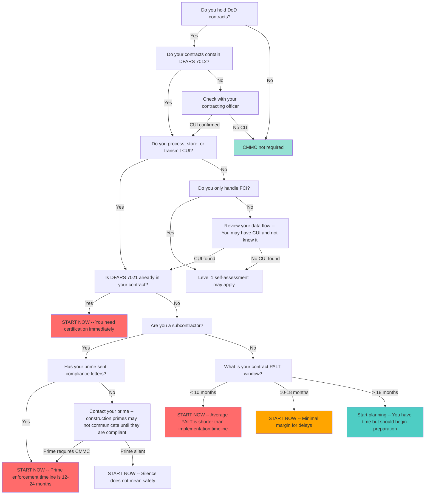

## Summary

You should get CMMC certification now if you handle CUI on DoD contracts, have DFARS 7012 in your contracts, or work for primes who are pressuring their supply chain. The "wait and see" window is closing -- DFARS 7021 is already appearing in Phase 1 contracts, and the average NAVAIR PALT window (8-10 months) is shorter than the typical implementation timeline (12-18 months). The 96% of the DIB that has not started preparing represents a massive readiness gap, and early adopters are already winning work based on compliance status.

## Decision Tree

## Detailed Walkthrough

### 1. Do you hold DoD contracts?

If you do not hold DoD contracts and do not plan to pursue them, CMMC is not currently required. However, the FAR CUI rule is expected to extend cybersecurity requirements beyond DoD to all federal work, so this exemption may not last.

**Action:** If no DoD work, monitor the FAR CUI rule development but no immediate action needed.

### 2. Do your contracts contain DFARS 7012?

DFARS 7012 is the foundational clause requiring NIST 800-171 implementation for CUI protection. If this clause is in your contract, you are already required to implement these controls today -- CMMC (via DFARS 7021) just adds third-party verification.

**Key fact:** DFARS 7012 has been enforceable since 2017. CMMC does not introduce new controls -- it verifies you actually implemented what you already claimed.

**Action:** Review your contracts for DFARS 252.204-7012. If present, continue to next question.

### 3. Do you process, store, or transmit CUI?

This is the critical question. Many companies underestimate their CUI footprint. The recommended approach (per Daniel Acreage, Summit 7) is to search your M365 commercial tenant and on-prem file systems for:

- **CUI banner markings**
- **DoD clauses**
- **DoD distribution statements** (Parts B through F)

**The construction company example:** A large construction company's CIO planned a 20-person enclave based on gut feeling. After running distribution statement searches, they found 570 files from DoD distribution statements alone -- and that was only what Microsoft could OCR through PDFs, email, and standard Office attachments. It did not include AutoCAD, SolidWorks, or Revit files.

**Action:** Do not rely on gut estimates. Run data flow analysis before deciding your CUI scope.

*(Source: [[Enclaves and Architecture Strategies]], Summit 7, June 2025)*

### 4. Is DFARS 7021 already in your contract?

DFARS 7021 is the CMMC certification clause. Phase 1 rollout began November 10, 2025, and contracts are already appearing with this language.

**If yes:** You need certification immediately. The contract requires it as a condition of award or continuation.

**If no:** Continue to assess your timeline -- DFARS 7021 is being added to new contracts and may appear in contract option years exercised after November 2025.

**The option year trap:** Many companies overlook that existing contracts with option years exercised after 48 CFR goes into effect may require CMMC certification. Unlike new solicitations where you can choose whether to bid, option year requirements hit existing work where you already have staff, infrastructure, and revenue at stake.

*(Source: [[Defense Contractors are Betting Their Companies on THIS Assumption About CMMC Phase 1]], Summit 7, September 2025)*

### 5. Are you a subcontractor?

Subcontractors face unique timeline pressure. Per 32 CFR 170 section 170.23A3, if your prime requires CMMC Level 2 C3PAO, you require it too. The simplest test: if your prime is Lockheed, BAE, HII, Northrop, RTX, or any major prime, they will handle CUI requiring that level of assurance.

**Prime contractor letters:** All major primes have been sending supplier notices since late 2025:

- Lockheed Martin, RTX (Raytheon), BAE Systems, HII (Huntington Ingalls), Northrop Grumman
- Northrop's letter explicitly states: "Contracting officers may not award contracts to non-compliant contractors" and "prime contractors may not award purchase orders to non-compliant subcontractors"
- Summit 7 reports these supplier announcements drove more inquiries than any rulemaking milestone

**Construction primes are a problem area:** Many primes in the construction space have not been communicating CMMC requirements because they are not compliant themselves yet. Once they achieve compliance, they will begin expecting compliance from subcontractors "pretty quickly" -- creating a compressed timeline.

*(Source: [[Primes Can't Waive CMMC]], Summit 7, December 2025; [[The CUI Hotline - Weekly CMMC Q&A Livestream!]], Summit 7, February 2026)*

### 6. What is your contract PALT window?

**PALT (Procurement Administrative Lead Time)** is the window from contract solicitation to contract award. This metric determines whether you have realistic time to achieve certification before award.

**NAVAIR PALT Analysis (1,070 opportunities from December 2025 forecast):**

| Contract Value | Opportunities | Average PALT (Months) |
|---|---|---|
| All unclassified | 550 | ~9 |
| Under $2M | 294 | ~8 |
| $2M -- $7.5M | 86 | ~9 |
| $100M -- $250M | 15 | ~15 |

**Key findings:**
- 35% of all opportunities have an award window of 6 months or less
- Smaller contracts = less time, disproportionately hurting small businesses
- Implementation timeline from ground zero: 12-18 months (per Jeff Smedley, Summit 7)
- Internal procurement to engage consultants/MSPs consumes approximately one quarter (3 months) of available time

**The mismatch:** The typical PALT window (8-10 months) is shorter than the typical implementation timeline (12-18 months). Summit 7's Jason states: "Eight months is not realistic for 85% of the organizations that I've spoken to in the past 90 days."

**Action:** Look up your specific contracts in Long Range Acquisition Forecasts and calculate your exact PALT window. If under 10 months, you are already behind. If 10-18 months, you have minimal margin for delays. Only contracts with 18+ months provide comfortable preparation time.

*(Source: [[No CMMC, No Contract - Why You're Already Too Late for NAVAIR]], Summit 7, February 2026)*

### 7. The 96% Problem

The most engaged CMMC community (Cooey COE Discord, practitioners self-educating through Summit 7 content) represents only 2-4% of companies that need Level 2. The other 96% are:

- Still scoring themselves using the outdated 5-level framework
- Trusting MSPs who said "we've got you covered" without doing real compliance work
- Assuming commercial M365 is sufficient for CUI handling
- Waiting for CMMC to "blow over"

**As of October 2025:** Over 450 Level 2 certifications existed -- all obtained voluntarily before any contract required it. These early adopters are already winning work based on compliance status.

**Jeff Smedley's billion-dollar case:** His company was selected by Lockheed specifically because "we know you already have CMMC taken care of." Early compliance became a competitive differentiator worth billions in contract value.

*(Source: [[CMMC Phase 1 - What Comes Next]], Summit 7, November 2025; [[Getting CMMC Executive Buy-In with Jeff Smedley]], Summit 7, July 2025)*

### 8. False Claims Act Risk

The False Claims Act (FCA) applies to DFARS 7012 compliance -- CMMC's status is irrelevant. The 2025 FCA settlement covered 2018-2023, a period when CMMC was paused but DFARS 7012/7019/7020 remained fully in effect.

**Key point:** Submitting invoices without DFARS 7012 compliance constitutes a false claim to the government. The Aerojet Rocketdyne precedent established that cybersecurity compliance is material to the contract.

**Action:** If you are billing the government while non-compliant with DFARS 7012, you have immediate FCA exposure regardless of CMMC status.

*(Source: [[FCA Whistleblower Strikes Again]], Summit 7, December 2025; [[DOJ vs Small Defense Contractors]], Summit 7, April 2025)*

## When to Start

### Start Immediately If:

- DFARS 7021 is in your contract
- Your prime has sent compliance deadline letters
- Your PALT window is under 10 months
- You handle CTI, DCISI, NNPI, PSI, or UCNID (CUI categories requiring Level 2 certification per January 2025 DoD memo)
- You are billing the government while non-compliant with DFARS 7012

### Start Planning Now If:

- DFARS 7012 is in your contract but 7021 is not yet
- Your PALT window is 10-18 months
- You are a subcontractor and your prime has not communicated requirements (silence does not mean safety)
- You have not done data flow analysis and are unsure of your CUI footprint

### Monitor But Don't Rush If:

- PALT window is 18+ months
- You only handle FCI (not CUI)
- No current DoD contracts but considering future work

## Implementation Timeline Expectations

From ground zero to certified (per Jeff Smedley, Summit 7):

- **Timeline:** 12-18 months for a 100-person company
- **Cost:** $100,000 per 100 employees benchmark
- **Bottleneck:** Not technology -- decisions, budgets, organizational buy-in, and cultural adoption
- **Common pitfall:** Executives think IT can fix this in "a month, couple months" -- this dramatically underestimates the effort

**False start rate:** During the voluntary market rollout (2025), 25-40% of companies that signed up for assessments were told to come back later -- they were not ready. These were companies that thought they were ready but got stopped in Phase 1 (document review).

*(Source: [[Getting CMMC Executive Buy-In with Jeff Smedley]], Summit 7, July 2025; [[CMMC Phase 1 - What Comes Next]], Summit 7, November 2025)*

## Common Misconceptions

| Misconception | Reality | Source |
|---|---|---|
| "CMMC will blow over" | DFARS 7021 is already in Phase 1 contracts; this is not a drill | [[Phase Rollout and Contract Language]] |
| "I'll wait until the solicitation to start preparing" | 35% of NAVAIR opportunities have 6-month or less award windows -- not enough time for 85% of organizations | [[No CMMC, No Contract - Why You're Already Too Late for NAVAIR]] |
| "Phase 1 means I have until November 2026" | November 2026 is the end of Phase 1, not a universal deadline; Level 2 certification has been possible since November 10, 2025 | [[The CUI Hotline - Weekly CMMC Q&A Livestream!]] |
| "My prime would have told me if I needed CMMC" | Construction primes are not communicating because they are not compliant yet; silence does not mean safety | [[The CUI Hotline - Weekly CMMC Q&A Livestream!]] |
| "I can just self-attest for the first year" | 32 CFR 170.3(E) says "majority" will be self-assessment, not "all"; five CUI categories require certification as the minimum | [[Defense Contractors are Betting Their Companies on THIS Assumption About CMMC Phase 1]] |

## Related Topics

- [[Phase Rollout and Contract Language]] -- when DFARS 7021 is appearing in contracts and what Phase 1 really means
- [[DFARS Clauses and Legal Requirements]] -- the clause stack (7012, 7019, 7020, 7021) and what each requires
- [[Assessment Process and Timeline]] -- what the certification process looks like and how long it takes
- [[CMMC Levels and Framework Structure]] -- Level 1 vs Level 2 vs Level 3 requirements
- [[Enclaves and Architecture Strategies]] -- data flow analysis and CUI scoping strategies
- [[False Claims Act and DOJ Enforcement]] -- FCA risk for non-compliance with DFARS 7012
- [[Market Dynamics and Service Needs]] -- the 96% problem and competitive advantage of early compliance

## Sources

- [[Phase Rollout and Contract Language]] -- DFARS 7021 in Phase 1 contracts, prime contractor pressure, NAVAIR as early adopter
- [[No CMMC, No Contract - Why You're Already Too Late for NAVAIR]] -- PALT analysis, 8-10 month average windows vs 12-18 month implementation timelines
- [[Defense Contractors are Betting Their Companies on THIS Assumption About CMMC Phase 1]] -- CUI categories requiring certification, contract option years trap
- [[Primes Can't Waive CMMC]] -- Prime contractor supplier letters, subcontractor flowdown requirements
- [[Getting CMMC Executive Buy-In with Jeff Smedley]] -- Implementation timeline and cost benchmarks, billion-dollar competitive advantage case
- [[CMMC Phase 1 - What Comes Next]] -- The 96% problem, false start rates, voluntary certification numbers
- [[Enclaves and Architecture Strategies]] -- Data flow analysis methodology, construction company 570-file example
- [[FCA Whistleblower Strikes Again]] -- DFARS 7012 compliance as material to contract, invoicing without compliance = false claim
- [[DOJ vs Small Defense Contractors]] -- FCA enforcement timeline (2018-2023), DFARS clause basis for claims
- [[The CUI Hotline - Weekly CMMC Q&A Livestream!]] -- November 2026 clarification, construction primes not communicating, PALT over phased rollout for planning
