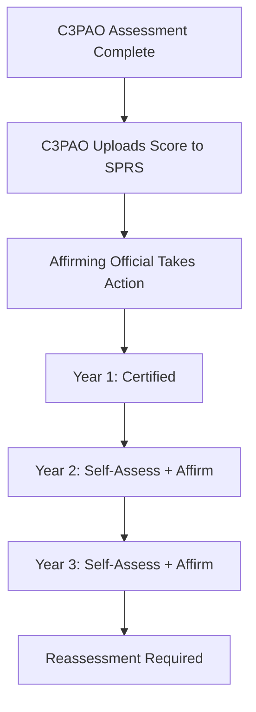

# SPRS and Annual Affirmation Requirements

## Key Takeaway

SPRS has **three separate tabs** for different compliance obligations, and after a C3PAO assessment you're still on the hook for **annual self-assessment and affirmation** in years 2 and 3. Get your CAGE code hierarchy right in SAM.gov first, or SPRS won't work at all.

---

## The Three SPRS Tabs

| Tab               | Purpose                                                           | Who Maintains It                                   |
| ----------------- | ----------------------------------------------------------------- | -------------------------------------------------- |
| **800-171**       | NIST 800-171 self-assessment score for DFARS 7012/7019 compliance | The OSC (you)                                      |
| **CMMC L2 Self**  | CMMC Level 2 self-assessment results                              | The OSC (you)                                      |
| **CMMC L2 C3PAO** | CMMC Level 2 C3PAO assessment results                             | The C3PAO uploads; Affirming Official takes action |

> [!important] The 800-171 Tab Is Still Required
> Even after a C3PAO assessment, the 800-171 tab must be maintained for 7012/7019 compliance. This score cannot be older than **3 years**.

## After a C3PAO Assessment

The process after your C3PAO assessment:

1. **C3PAO uploads** your assessment score to the CMMC L2 C3PAO tab
2. **Affirming Official** must take action — this is a named individual at your organization who certifies the results
3. The Affirming Official's action is what makes the certification official in SPRS

## Annual Affirmation — Years 2 and 3

Your C3PAO certification is valid for 3 years, but it's **not a set-it-and-forget-it situation**:

### Year 1
- C3PAO assessment completed and uploaded to SPRS
- Affirming Official takes action

### Year 2
- Conduct an **annual self-assessment** of your NIST 800-171 controls
- Submit an **affirmation** in SPRS confirming continued compliance
- This is separate from the C3PAO certification

### Year 3
- Same as Year 2 — self-assess and affirm again
- Begin planning for reassessment if your certification is expiring

> [!warning] L1 and L2 Environments May Require Separate Affirmations
> If your Level 1 environment differs from your Level 2 environment, you must **separately self-assess and affirm Level 1 annually**.
>
> "Hint: that's a lot of work, so try to put all your FCI in your L2 environment."
> — Glenda, Lead CCA

## CAGE Code and SAM.gov Prerequisites

> [!danger] Fix SAM.gov Before Touching SPRS
> Your **CAGE code hierarchy in SAM.gov** must be correct before SPRS will work. If your entity structure is wrong in SAM, SPRS won't properly associate your assessments with your organization.

Before submitting anything to SPRS:
1. Verify your CAGE code is active and correct in SAM.gov
2. Confirm the organizational hierarchy (parent/child relationships) is accurate
3. Ensure your Affirming Official has the proper access and roles

## Common Mistakes

| Mistake | Consequence |
|---------|------------|
| Forgetting annual affirmation | Certification lapses — you're no longer compliant |
| Wrong CAGE code hierarchy | SPRS can't associate your scores properly |
| Only maintaining C3PAO tab | 800-171 tab still required for DFARS 7012/7019 |
| Separate L1 environment without separate affirmation | Non-compliant for Level 1 FCI handling |
| No designated Affirming Official | Can't complete the certification process |

## The Affirmation Workflow

## Related Articles

- [[CMMC Assessment Process - What to Expect]]
- [[When is CMMC Required]]
- [[Scoping ESP and CRM Confusion]]
- [[Reassessment and Significant Changes]]
- [[Community Sentiment and Common Frustrations]]
