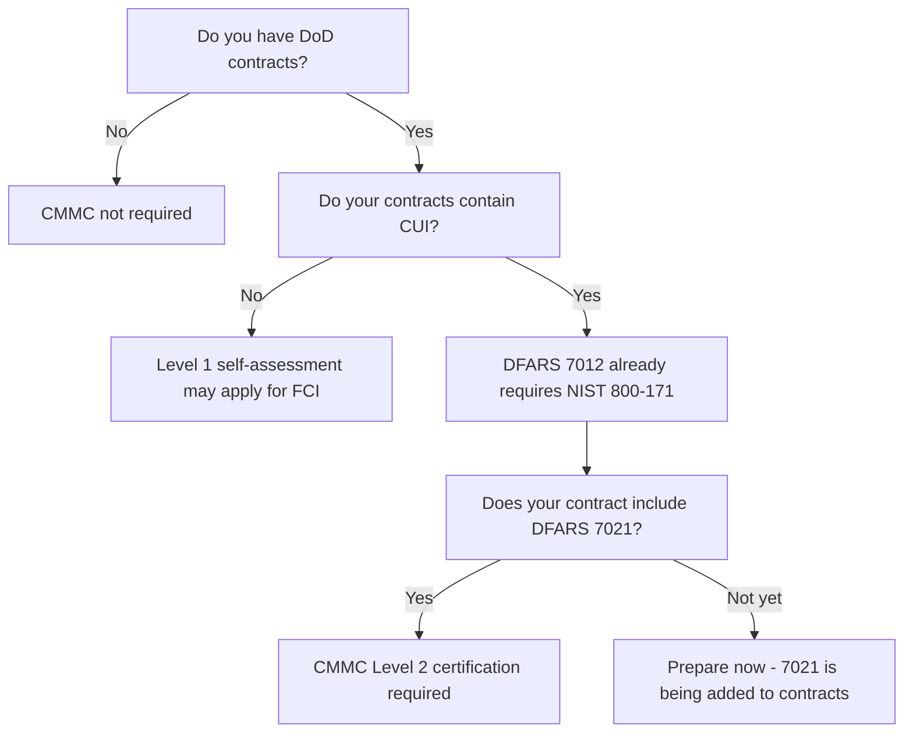

# When is CMMC Required

## Key Takeaway

CMMC certification is required when **DFARS 252.204-7021** appears in a contract. But the underlying CUI protection requirements (NIST 800-171) are already enforceable today under DFARS 7012 — CMMC adds a **verification layer**, not a new set of controls.

---

## The DFARS Clause Stack

Understanding when CMMC kicks in requires understanding the four DFARS clauses that work together:

| Clause | What It Does | Status |
|--------|-------------|--------|
| **DFARS 252.204-7012** | CUI protection — requires NIST 800-171 implementation | **Already required** in contracts with CUI |
| **DFARS 252.204-7019** | Self-assessment — requires NIST 800-171 assessment score in SPRS | **Already required** |
| **DFARS 252.204-7020** | DIBCAC authority — gives DoD the right to audit you | **Already required** |
| **DFARS 252.204-7021** | CMMC certification — requires third-party or self-assessment certification | **Phase 1 rollout underway** |

> [!important] CMMC Sits On Top
> 7021 and CMMC sit **ON TOP OF** 7012/7019 — they don't replace them. You still need to comply with the underlying CUI protection requirements. CMMC is the verification mechanism, not a new framework.

## Phase 1 Rollout Is Happening Now

Contracts are already appearing with CMMC requirements. NAVAIR has been cited as an early adopter, and other agencies are following.

> [!warning] Don't Wait
> The "it'll blow over" crowd is running out of runway. Phase 1 is underway, and contracts with 7021 language are being issued. If you haven't started, you're already behind.

## The 96% Problem

The CMMC Discord community — already one of the most engaged groups of DIB practitioners — represents roughly 2-4% of the companies that need CMMC Level 2. The other 96% are not self-educating.

This creates a massive risk pool:
- Companies scoring themselves at "88" for Level 1 using the outdated 5-level framework
- Companies that think commercial M365 is sufficient
- Companies whose MSP told them "we've got you covered" without any real compliance work

## Prime Contractor Pressure

The enforcement wave isn't just coming from DoD. **Primes are starting to pressure their supply chains**:

- Letters with compliance deadlines are being sent to subcontractors
- Some primes are requiring evidence of CMMC readiness as a condition of continuing the relationship
- The enforcement wave from primes is estimated at **12-24 months out** from widespread implementation

This means even if 7021 hasn't appeared in your specific contract yet, your prime may be demanding action.

## How to Know If You Need CMMC

## Related Articles

- [[When is FedRAMP Required]]
- [[CMMC Assessment Process - What to Expect]]
- [[SPRS and Annual Affirmation Requirements]]
- [[Community Sentiment and Common Frustrations]]
- [[Reassessment and Significant Changes]]
